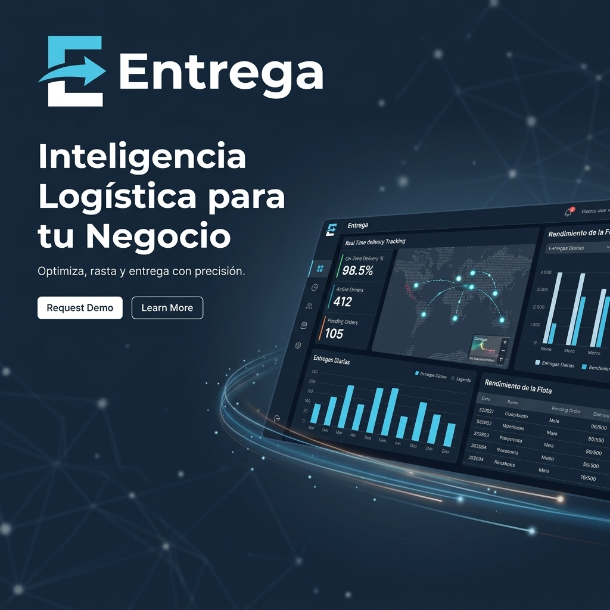
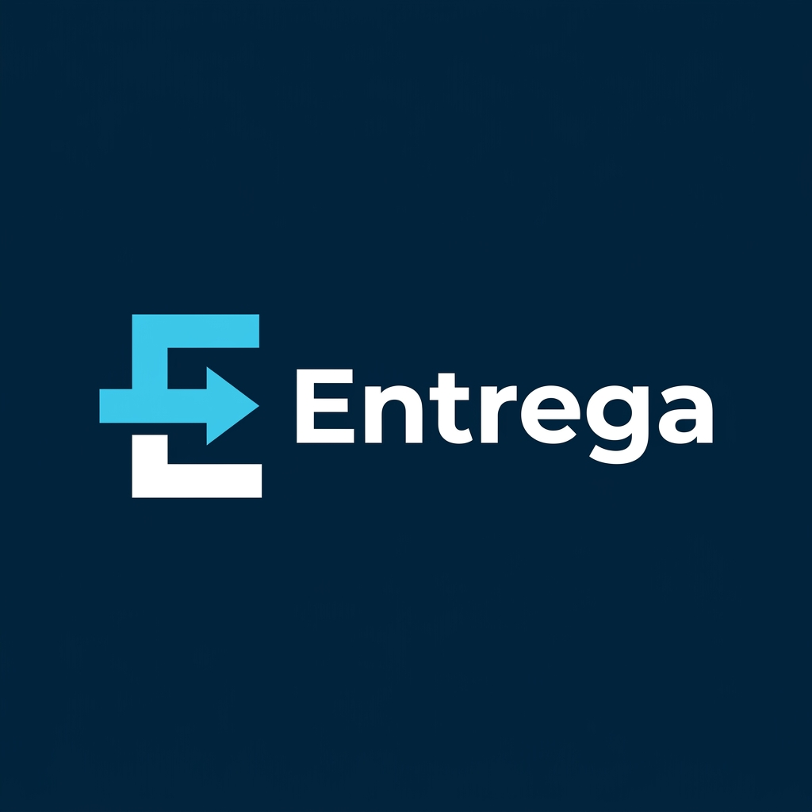
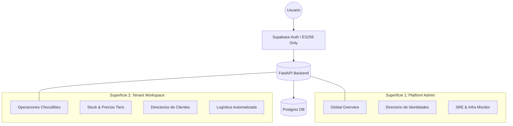

<div align="center">
  
  <p><i>Gestión Inteligente de Logística al Alcance de tu Mano.</i></p>
  
  <p>
    
    
  </p>
</div>

---

## ⚡ El Concepto
**Entrega** es una plataforma logística de nueva generación diseñada para profesionalizar pequeñas flotas y negocios en crecimiento. Nacida del caos de los grupos de WhatsApp y las hojas de cálculo, Entrega centraliza pedidos, clientes y stock en una experiencia **mobile-first** de alto nivel.

## 🛠️ Tech Stack Universo Entrega

| Capa | Tecnologías |
| :--- | :--- |
| **Frontend** | `Next.js 14` (App Router), `TailwindCSS`, `Lucide Icons`, `Framer Motion` |
| **Backend** | `FastAPI` (Python), `SQLModel`, `Uvicorn`, `Pydantic v2` |
| **Persistencia** | `PostgreSQL` via `Supabase`, `Migrations` via `Alembic` |
| **Seguridad** | `Supabase Auth` (Filtro ES256 via JWKS), `RBAC` Multi-Capas |
| **Integración** | `WhatsApp Business Cloud API` (Meta) |

---

## 🏰 Arquitectura: Doble Superficie
Entrega opera bajo un modelo de **Split Arquitectónico** que separa la gestión de infraestructura de las operaciones del negocio.



---

## 🔐 Seguridad y Auditoría
La plataforma EntréGA v1.1 cumple con estándares de seguridad modernos, eliminando soporte para algoritmos legados (HS256) en favor de criptografía asimétrica.

- **Algoritmo Mandatario**: `ES256` (Elliptic Curve Digital Signature Algorithm).
- **Validación de Identidad**: Integración nativa con Supabase via `JWKS` (JSON Web Key Sets).
- **Lincado Automático**: Sincronización transparente de identidades entre Supabase y el perfil local de `public.users`.
- **RBAC**: Control de acceso basado en roles (Owner, Admin, User) aplicado en capa de middleware a nivel plataforma y tenant.

---

## 🏢 Multi-Tenant Wiki
Para entender cómo manejamos el aislamiento de datos, los roles de usuario (Hugo vs. Leo) y la inyección de contexto por negocio, consulta nuestra documentación especializada:

👉 **[Wiki de Tenants & Arquitectura](docs/TENANTS.md)**

## ⚡ Rendimiento y Resiliencia
La plataforma EntréGA v1.1 ha sido validada técnicamente para soportar carga productiva real mediante una arquitectura de procesamiento asíncrono.

👉 **[Reporte de Validación Checkpoint 2](docs/reports/checkpoint2_validation.md)**

---

## 🚀 Guía de Inicio Rápido (Devs)

### 1. Clonar y Configurar
```bash
git clone https://github.com/aacshar14/Entrega.git
cd Entrega
```

### 2. Backend (FastAPI)
```bash
cd apps/api
pip install -r requirements.txt
# Configura tu .env con DATABASE_URL y SUPABASE_KEYS
py -m uvicorn app.main:app --reload
```

### 3. Frontend (Next.js)
```bash
cd apps/web
npm install
npm run dev
```

---

<div align="center">
  <p><i>Crafted for ChocoBites & The New Logistics Generation</i></p>
  
</div>
