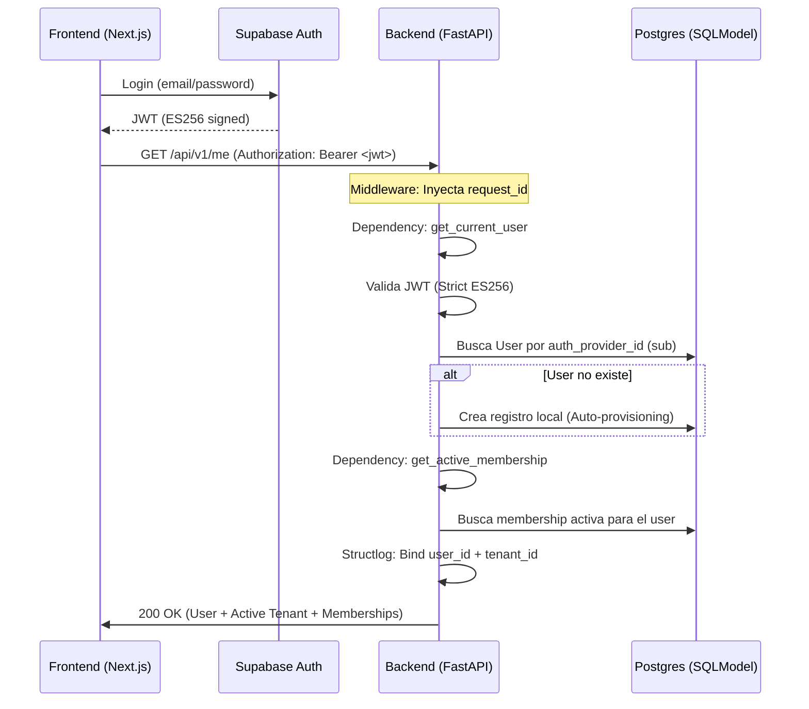

# EntréGA Authentication & Tenant Resolution Contract (V1.1)

## Overview
Este documento define el flujo determinista de autenticación y resolución de contexto para la plataforma EntréGA V1.1. El objetivo es eliminar la deuda técnica de HS256, automatizar el aprovisionamiento de usuarios y asegurar una trazabilidad total en los logs.

## 1. Authentication Flow (Human Users)



## 2. API Contract: `/api/v1/me`

**Endpoint**: `GET /api/v1/users/me` (aliased as `/me`)
**Auth Required**: `Bearer <Supabase_JWT>`

### Expected Response
```json
{
  "user": {
    "id": "uuid",
    "email": "user@example.com",
    "full_name": "Nombre Apellido",
    "platform_role": "user"
  },
  "active_tenant": {
    "id": "uuid",
    "name": "Mi Tienda",
    "slug": "mi-tienda",
    "onboarding_step": 4,
    "ready": true
  },
  "memberships": [
    {
      "tenant": { ... },
      "role": "owner",
      "is_default": true
    }
  ]
}
```

## 3. Implementation Locations

| Feature | File Path | Mechanism |
| :--- | :--- | :--- |
| **Request Trace** | `app/core/middleware.py` | `ObservabilityMiddleware` (request_id) |
| **JWT Validation** | `app/core/dependencies.py` | `get_current_user` (Strict ES256) |
| **User Identity** | `app/core/dependencies.py` | `get_current_user` (Auto-provisioning) |
| **Tenant Scoping** | `app/core/dependencies.py` | `get_active_membership` |
| **Observability** | `app/core/dependencies.py` | `structlog.contextvars.bind_contextvars` |

## 4. Security Hardening (Anti-Patterns to Avoid)

1.  **NO HS256 Support**: El backend solo debe aceptar `ES256`. Cualquier fallback a secret keys simétricas es deuda técnica y riesgo de seguridad.
2.  **NO Blocking Health Checks**: El endpoint `/api/v1/health/` no debe tener dependencias de base de datos para evitar timeouts de Cloud Run.
3.  **NO Manual user_id passing**: Siempre usar `structlog` contextvars para el logging. No pasar `user_id` manualmente entre funciones internas si es para propósitos de observabilidad.
4.  **Forward References**: Usar `"User"` en lugar de `User` en firmas de dependencias para evitar `ImportError` circulares que rompen el despliegue.

## 5. Webhooks & Integrations

Para integraciones externas (Meta/WhatsApp), el flujo **no utiliza JWT**. 
- Se valida la firma HMAC enviada por Meta.
- El contexto de `user_id` puede ser nulo, pero el `tenant_id` DEBE ser resuelto a partir del `phone_number_id` o el `WABA_ID` recibido en el payload.
