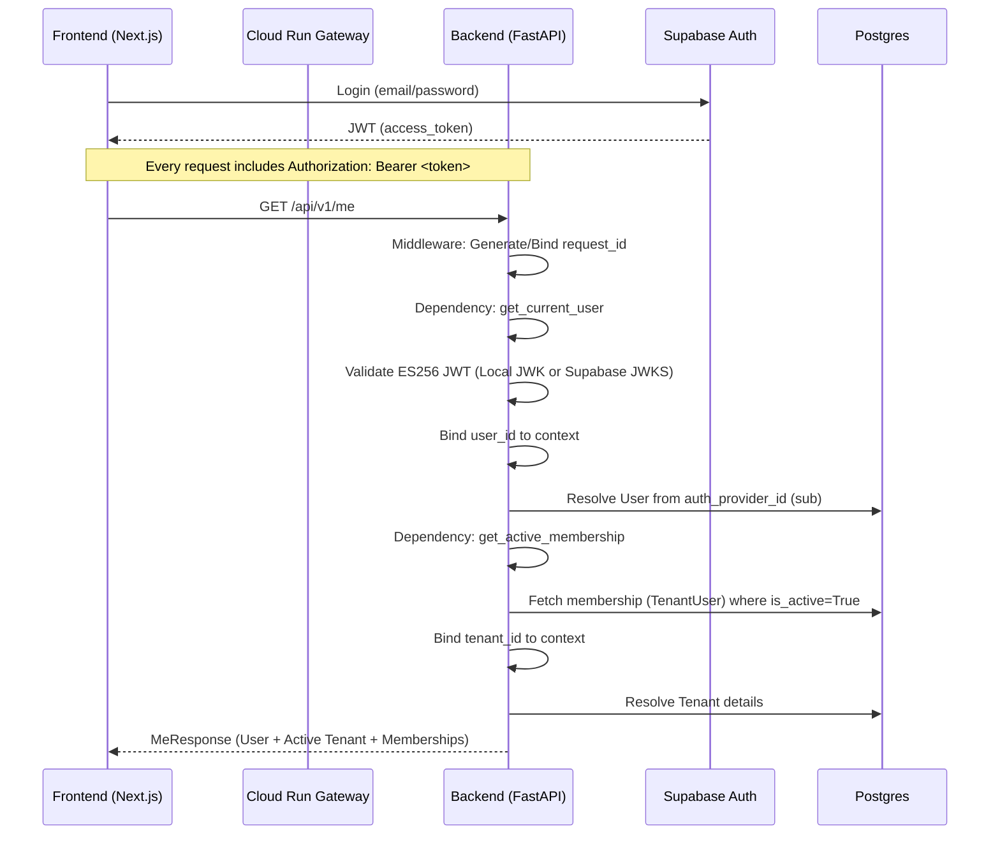

# EntréGA Authentication & Tenant Resolution Flow (v1.1)

This document describes the deterministic authentication and context resolution flow for the EntréGA platform.

## 1. Sequence Diagram (Human Platform Flow)



## 2. API Contract: `GET /api/v1/me`

### Expected Response Format
```json
{
  "user": {
    "id": "uuid",
    "email": "user@example.com",
    "full_name": "John Doe",
    "platform_role": "user|admin"
  },
  "active_tenant": {
    "id": "uuid",
    "name": "Entrega Demo",
    "slug": "entrega-demo",
    "onboarding_step": 4,
    "ready": true
  },
  "memberships": [
    {
      "tenant": { ... },
      "role": "owner|admin|operator",
      "is_default": true
    }
  ]
}
```

## 3. Request Context Binding Points

| Context Variable | Bound In | Condition |
| :--- | :--- | :--- |
| `request_id` | `ObservabilityMiddleware` | Every request. |
| `user_id` | `get_current_user` | Requests with Authorization header. |
| `tenant_id` | `get_active_membership` | Dashboard requests (Tenant scoped). |

## 4. Separation of Webhook Logic
*   **Webhooks (Meta/WhatsApp)**: Defined in `app/api/v1/endpoints/webhooks.py`.
*   **Security**: Do NOT use `get_current_user`. Use custom signature validation (HmacSHA256).
*   **Context**: Webhooks must bind `tenant_id` manually from the webhook payload or URL parameter to maintain deterministic logging.

## 5. Anti-Patterns to Avoid
1.  **Circular Imports**: Never import models at the top level of `dependencies.py`.
2.  **Explicit DB calls in Health**: Liveness checks must be static to pass Cloud Run startup probes.
3.  **Blocking Sync connections**: Avoid `engine.connect()` at the top level of any module.
4.  **HS256 Fallback**: Use only ES256 for production hardening.
