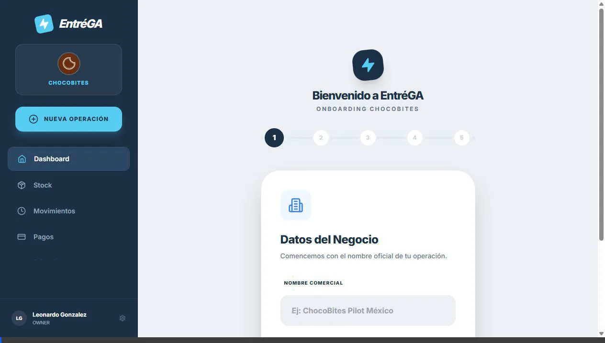
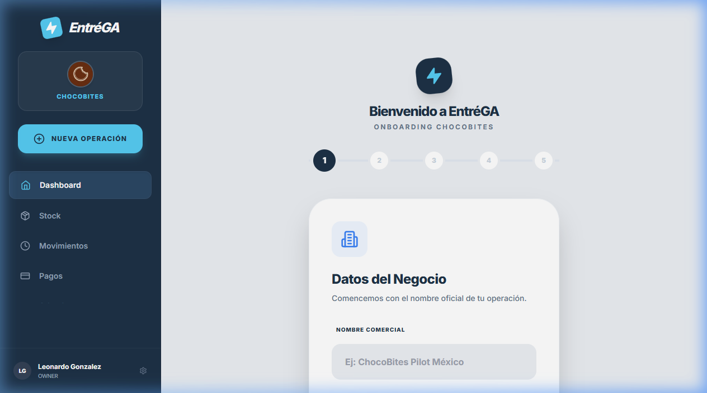
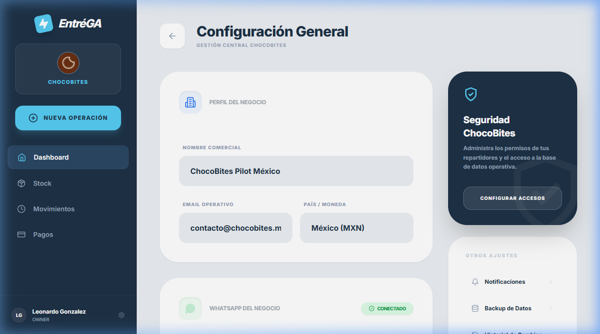

# Know How - EntréGA App

Este documento recopila guías y formatos estándar para el uso de la aplicación por parte de los tenants y operadores.

## Importación de Clientes (CSV)

El formato recomendado para realizar la carga masiva de clientes en la plataforma es un archivo CSV con el siguiente esquema:

**Encabezados:**
`name,phone,email,initial_balance,notes`

**Ejemplo de datos:**

```csv
name,phone,email,initial_balance,notes
Ana,+528781111111,ana@email.com,650,Cliente frecuente
Luis,+528782222222,,300,
Martha,+528783333333,martha@email.com,0,Paga semanal
```

### Consideraciones técnicas

1. **name**: El nombre completo o identificador del cliente. (Obligatorio)
2. **phone**: Teléfono a 10-12 dígitos incluyendo código de país (Ej: +52 para México). (Obligatorio para notificaciones WhatsApp)
3. **email**: Opcional. Se puede dejar en blanco si no se cuenta con él.
4. **initial_balance**: Saldo inicial que el cliente debe a la fecha de carga. (Default: 0)
5. **notes**: Notas adicionales o referencias del cliente.

## Importación de Stock y Productos (CSV)

Para cargar tu inventario inicial y catálogo de productos, utiliza el siguiente formato CSV:

**Encabezados:**
`name,sku,price,initial_stock,category`

**Ejemplo de datos:**

```csv
name,sku,price,initial_stock,category
Chocolate Amargo 70%,CH-AM-001,150.0,100,Chocolates
Chocolate con Leche,CH-LE-002,120.0,50,Chocolates
Caja de Regalo Grande,ACC-001,45.0,20,Accesorios
```

### Consideraciones técnicas adicionales

1. **name**: Nombre comercial del producto. (Obligatorio)
2. **sku**: Identificador único o código de barras del producto. (Opcional, pero recomendado)
3. **price**: Precio de venta al público en formato decimal. (Default: 0.0)
4. **initial_stock**: Cantidad física disponible al momento de la carga. (Genera un saldo de stock automático)
5. **category**: Etiqueta para agrupar productos en el catálogo. (Opcional)

---

## 🎥 Videos y Demos Operativos

Para facilitar el onboarding de nuevos negocios como **ChocoBites**, utiliza estos recursos visuales:

### ⚡ Demo de Onboarding Completo (4 Pasos)
Este video muestra el flujo desde el registro de datos del negocio hasta la activación final tras conectar WhatsApp y subir los CSVs de clientes y stock.



### 🛠️ Guía Visual de Configuración
Capturas detalladas de los módulos críticos:

*   **Paso 1: Datos del Negocio**
    
    *Sección inicial para definir el nombre comercial de la operación.*

*   **Paso 2: WhatsApp del Negocio**
    
    *Vista de configuración donde se gestiona la conexión con Meta Business Platform.*

---

## 🧠 Knowledge Base & Lessons Learned (Technical)

Este registro documenta errores críticos resueltos durante el escalamiento a V1.1 y el despliegue del piloto **ChocoBites**.

### 1. Backend: Startup de Cloud Run
*   **Problema:** Error `NameError: name 'get_active_tenant_id' is not defined` en el arranque.
*   **Causa:** Aunque una dependencia se use mediante `Depends()`, FastAPI necesita que el nombre esté importado o definido explícitamente en el módulo del endpoint para evitar errores de scope global al momento del arranque de Uvicorn.
*   **Lección:** Siempre importar `get_active_tenant_id` y `require_roles` desde `app.core.dependencies` en cada archivo de la API (`v1/endpoints/*.py`).

### 2. Infraestructura: Despliegues Inmutables
*   **Problema:** Cloud Run desplegaba revisiones con código "stale" (viejo) a pesar de subir una imagen nueva.
*   **Causa:** El uso de la tag `:latest` provoca problemas de cache y falta de trazabilidad.
*   **Lección:** Implementar **SHA Tagging**. Cada imagen se taggea con el hash del commit (`$GITHUB_SHA`). El comando de `gcloud run deploy` debe apuntar específicamente a esa tag única.

### 3. CI/CD: Smoke Tests Mandatorios
*   **Problema:** Imágenes con errores de importación llegaban al registro de contenedores y fallaban recién en Cloud Run.
*   **Causa:** El build de Docker pasaba ocultando errores lógicos de Python.
*   **Lección:** Añadir un **Smoke Test** en el pipeline. Antes de hacer `push`, ejecutar:
    `docker run --rm $IMAGE python -c "from app.main import app; print('🚀 Smoke test OK')"`
    Esto garantiza que el contenedor es funcional al 100% antes de ser promovido.

### 4. Frontend: Resolución de Módulos (Next.js)
*   **Problema:** Error `Module not found: Can't resolve '../../lib/...'` durante el build.
*   **Causa:** Las rutas relativas profundas son frágiles y fallan según la estructura del runner de build o la sensibilidad a mayúsculas del OS (Linux vs Windows).
*   **Lección:** Usar **Path Aliases** (`@/`). Configurar `tsconfig.json` para mapear `@/*` a `./*`. Esto hace que las importaciones sean absolutas respecto a la raíz del proyecto y mucho más robustas.

### 5. Frontend: Case Sensitivity
*   **Problema:** El build pasa en local (Windows) pero falla en CI/Docker (Linux).
*   **Causa:** Windows es insensible a mayúsculas en archivos, Linux no.
*   **Lección:** Activar `"forceConsistentCasingInFileNames": true` en `tsconfig.json`. Esto obliga a que el import coincida exactamente con el nombre de archivo en disco, evitando sorpresas en producción.

### 6. Next.js: Static Prerendering (Static Generation)
*   **Problema:** `npm run build` falla con `Error: supabaseUrl is required`.
*   **Causa:** `Next.js` intenta pre-renderizar páginas estáticas durante el build y los archivos de `lib/supabase.ts` se ejecutan sin variables de entorno presentes.
*   **Lección:** Proporcionar un `.env.local` con placeholders o valores de staging durante el paso de build en el pipeline para permitir que la generación de páginas finalice correctamente.
