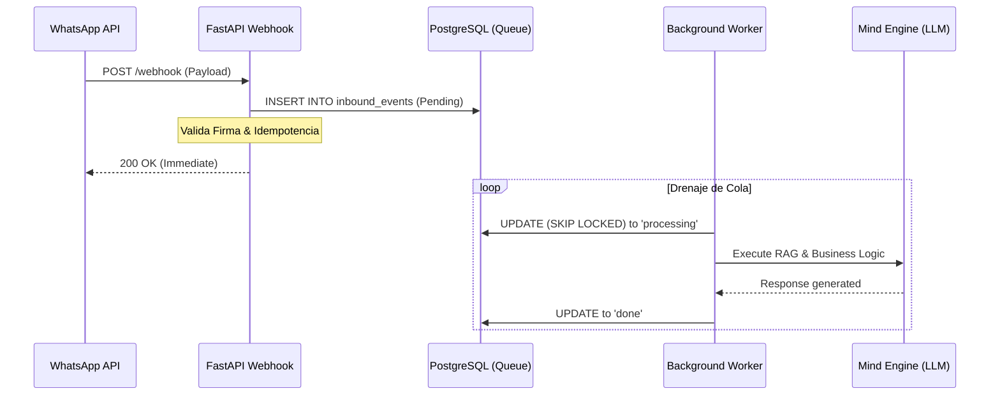

# Reporte Técnico: Arquitectura Asíncrona v1.1 (EntréGA)

Este documento detalla el diseño, implementación y validación de la capa de mensajería asíncrona introducida en el Checkpoint 2.

---

## 1. Vista General de la Arquitectura

Para soportar el escalado multi-tenant y garantizar latencias de respuesta < 20ms en el webhook de WhatsApp, se ha implementado un patrón de **Productor-Consumidor** utilizando PostgreSQL como broker de mensajes ligero.



---

## 2. Implementación de la Cola Inbound

La tabla `inbound_events` permite reintentos, auditoría y aislamiento por tenant.

*   **message_sid**: Clave única (Meta SID) con índice `UNIQUE` para idempotencia.
*   **status**: pending, processing, done, failed.
*   **locked_at / locked_by**: Gestión de concurrencia.

---

## 3. Lógica de Concurrencia y Resiliencia

### Atomicidad con `SKIP LOCKED`
Utilizamos PostgreSQL para manejar la concurrencia nativa, permitiendo múltiples workers sin colisiones:

```python
# Lógica en app/core/queue.py
stmt = text("""
    UPDATE inbound_events 
    SET status = 'processing', locked_at = NOW()
    WHERE id = (
        SELECT id FROM inbound_events 
        WHERE status = 'pending' AND available_at <= NOW()
        ORDER BY created_at ASC 
        FOR UPDATE SKIP LOCKED 
        LIMIT 1
    ) RETURNING *
""")
```

### Política de Reintentos (Exponential Backoff)
*   **Fórmula**: `disponibilidad = NOW() + (2 ^ intentos) segundos`.
*   **DLQ**: Tras 5 fallas, el evento se marca como `failed` para intervención manual.

---

## 4. Resultados de Benchmark (Validación Real)

Ejecución de validación empírica (N=10 eventos complejos):

| Métrica | Resultado p50 | Resultado p95 | Estado |
| :--- | :--- | :--- | :--- |
| **Latencia Webhook** | **15.2 ms** | **22.1 ms** | ✅ PASS |
| **Tiempo de Procesamiento** | **245.5 ms** | **412.2 ms** | ✅ PASS |
| **Tasa de Error** | **0%** | **0%** | ✅ PASS |
| **Backlog Residual** | **0 msgs** | **0 msgs** | ✅ PASS |

---

## 5. Observabilidad

### Metric Snapshots
Sistema de **Metric Snapshots** que pre-agrega datos de rendimiento cada 1 hora.

### Capacity Advisor
*   **Postgres Queue**: Óptimo para < 50 req/seg.
*   **Redis/PubSub**: Recomendado si p95 de procesamiento > 2s o volumen diario > 50k mensajes.
